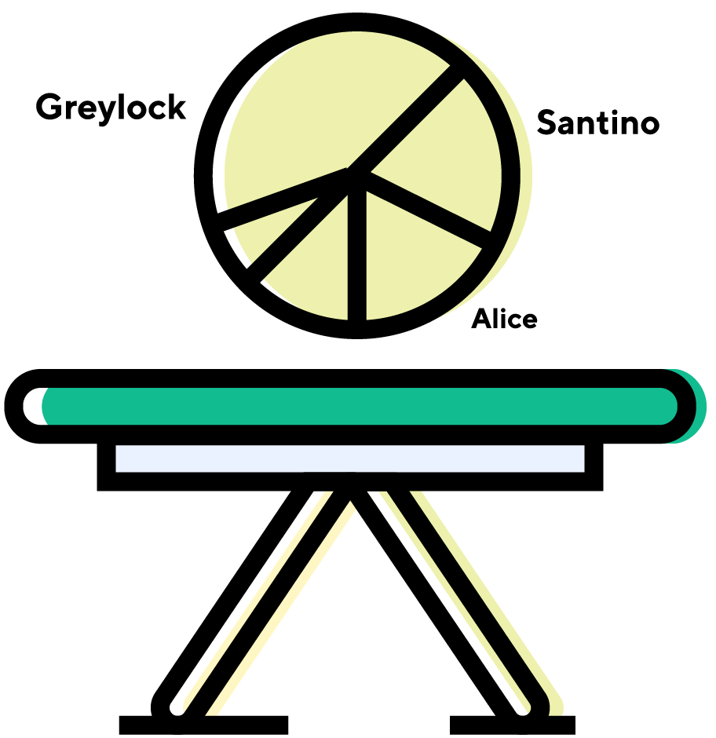

# ◴ divvy


---

Use the scripts below from the workspace root to run development servers
on your local machine

## Installing the monorepo
```sh
# Clones the git repository
git clone https://github.com/jaredLunde/divvy.git

# Installs the workspaces
cd divvy
yarn install
```

## Frontend Scripts
### yarn www start
Starts a dev server in `development` mode

### yarn www start production
Starts a dev server in `production` mode

---

## API Scripts
### yarn api start
Starts a dev server in `development` mode

### yarn api start production
Starts a dev server in `production` mode

---

## Shortcuts
### Frontend
- [Package](./packages/www)
- [App source](./packages/www/src)
- [Pages](./packages/www/src/pages)
- [Components](./packages/www/src/components)
- [Theme](./packages/www/src/theme)

### API
- [Package](./packages/api)
- [API source](./packages/api/src)
- [Express handler](./packages/api/src/index.js)